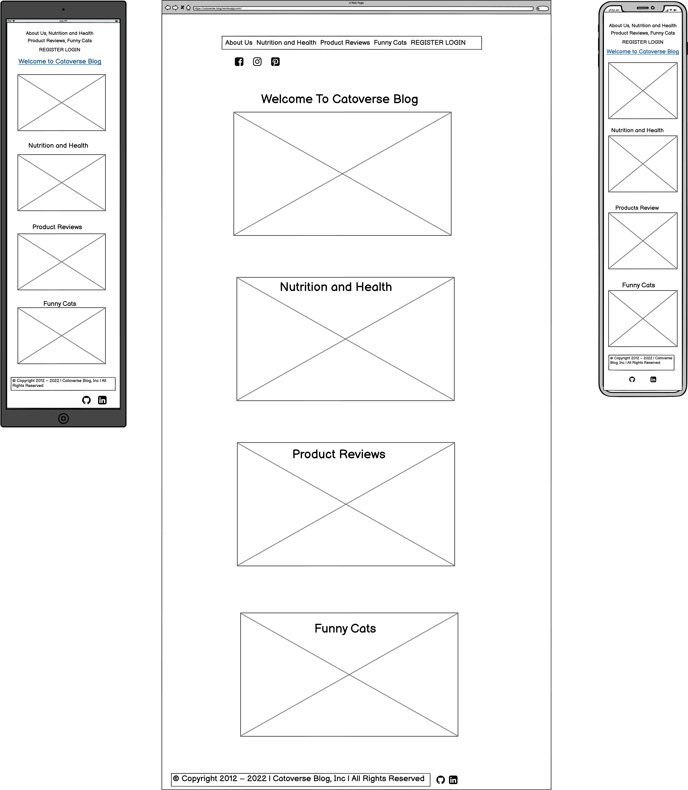
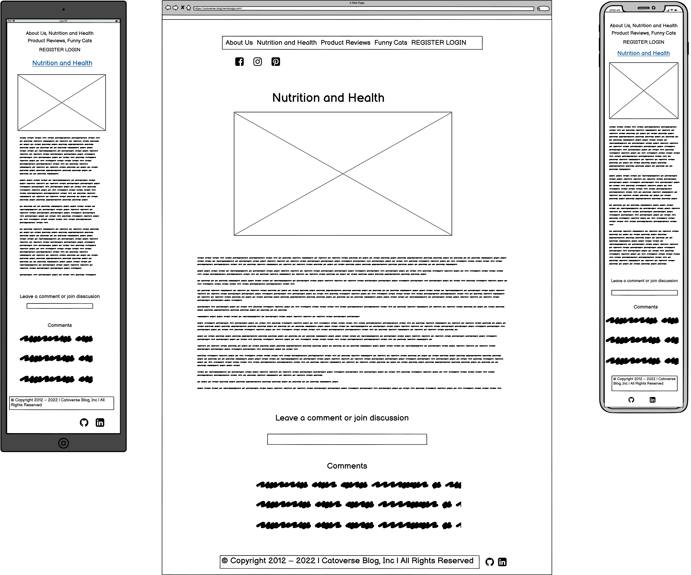

# Catoverse-Blog
Catoverse-Blog is designed for cat lovers. It helps understand cats behaviour and their needs better.
Users can share tips and experiences.

You can access live page to Catoverse-Blog by clicking [here](https://catoverse-blog.herokuapp.com/).

# User Experience
## Epics and User Stories

  - Epics and User Stories are made with an Agile approach. 

  - As a User I want toi see comment box so I can comment blog article.
  - As a User I want to see a heart symbol so that I can like the post or a comment written by another user.
  - As a User I want to see register or sign up button so that I can create my account to be able to comment blog articles.
  - As a User I would like to see a delete button on a comments page so that I can delete my comment if I want.
  - As a User I want to see edit button so that I can edit my comment.

## Features
- Navigation
    - Navigation is set at the center of the page with options to choose : 
      "Home", "Nutrition and Health", "Funny Cats", "Register" and "Login".

      - "Home" brings back User to the main page.
      - "Nutrition and Health" shows blog content related to cats health.
      - "Funny Cats" is a page where User can comment funny images and be involve in a competition and Weekly prize draws.

  - Blog post images with Author's name, Title and main topic, date when the blog is posted and paw icon which shows how many "paws/likes" does each blog have.

- Footer with Copyright sign, year when it was created and Blog name.

- Register link where the User can register and start commenting on the blog posts and "like" them.

- Logout link where User can logout from the account.

## Goals

### Visitor goals

The target audience are all the people who love cats and are interested in different topics related to cats.

- To view and find interesting blog posts about cats.
- To learn more about cats and their behaviour.
- To be able to register and comment blog posts.
- To like blog posts.
- To write about their experience with cats and to give advice.

### User Goals

As a user I would like to:

- Be able register and create account.
- Be able to comment blog posts.
- Be able to delete my posts.
- Be able to like posts.

## Wireframes
All wireframes are created with [Balsamiq](https://balsamiq.com/) during the Scope Plane part of the design and planning process for this project.

Main Page

About Us

Nutrition and Health

Product Review

Funny Cats

Register Page

Sign In Page

Style and font Used:

## Testings

To view all testing documentation please refer to [TESTING.md](TESTING.md)

### Local Deployment

In order to make a local copy of this repository, you can type the following into your IDE Terminal:

- `git clone https://github.com/Ivana505/catoverse-blog.git` 

Alternatively, if using Gitpod, you can click below to create your own workspace using this repository.

The site was deployed to [Heroku](https://catoverse-blog.herokuapp.com/) pages using following steps: 
   - Sign up or Login to Heroku 
   - Click on the "NEW APPLICATION" and create an App name and choose your region
   - Click on "Deploy" and choose your deployment method
   - If you are connecting with Github choose your main branch and find your repository
   - Add config vars PORT = 8000 and buildpacks python and nodejs
   - Click on deploy manually or automatically
   - The project has now been deployed
   - When deployed click on view
   - If you click on settings on the main menu bar you will find your Heroku git URL

    To install the required packages for this application, type the following: pip3 install -r requirements.txt

import pyfiglet
import random
import sys
import os

The live site can be previewed [here](https://catoverse-blog.herokuapp.com/).

  # Languages and technologies used
- [Python](https://www.python.org/) - used for core programming language and logic
- [Github](https://github.com/) - used for securely storing the code online
- [Git](https://git-scm.com/) - used for version control
- [Gitpod](https://www.gitpod.io/) - used for online cloud IDE and development
- [Heroku](https://heroku.com/) - platform used to deploy game to cloud online
- [Django Secret Key Generator](https://miniwebtool.com/django-secret-key-generator/)
- [Font Awesome](https://fontawesome.com/) - for Icons on the page

## Credits and Acknowledgements

  Main credit for the code that helped me in this learning process and to create this project was Full Stack Frameworks (FST) videos: "Hello Django" and "I Think Therefore I Blog".

  Image and Social Media sources:
- [YouTube channel ](https://www.youtube.com/)
- [Pixabay](https://pixabay.com/?utm_source=link-attribution&amp;utm_medium=referral&amp;utm_campaign=image&amp;utm_content=1196761) - image by Andreas Almstedt
- [Pixabay](https://pixabay.com/users/naturell-10315240/?utm_source=link-attribution&amp;utm_medium=referral&amp;utm_campaign=image&amp;utm_content=5237869) - photo by Aline (Алевтина) Mueller
- [Pixabay](https://pixabay.com/users/miezekieze-607096/?utm_source=link-attribution&amp;utm_medium=referral&amp;utm_campaign=image&amp;utm_content=6934928S) - photo by miezekieze
- [Pixabay](https://pixabay.com/users/vistawei-915694/?utm_source=link-attribution&amp;utm_medium=referral&amp;utm_campaign=image&amp;utm_content=1092371") - photo by vistawei

  Other sources
  - [Katzenworld](https://katzenworld.co.uk/)
  - [The Purrington Post](https://www.thepurringtonpost.com/)
  - [The Fluffy Kitty](https://thefluffykitty.com/)
  - [The Catnip Times](https://www.thecatniptimes.com/)
  - [MDBootstrap](https://mdbootstrap.com/docs/standard/navigation/footer/) - for adding footer with bootstrap
  - [Get bootstrap](https://getbootstrap.com/docs/4.0/components/card/#header-and-footer) - to add footer to base.html by using cards
  - [Toptal]https://www.toptal.com/designers/htmlarrows/) - to look for HTML Symbols
  - [Wagwalking](https://wagwalking.com/cat/condition/obesity) - text for the obesity in cats blog post
  - [Humane Society](https://www.humanesociety.org/resources/trimming-cats-claws) - text for the trimming of cats claws
  - [Litter Robot](https://www.litter-robot.com/blog/heterochromia-cats-with-different-colored-eyes/) - text for heterochromia blog post
  - [Developer Mozilla](https://developer.mozilla.org/en-US/docs/Learn/Server-side/Django/Home_page) - for adding paths
  - [Pythonista Planet](https://pythonistaplanet.com/template-extending-in-django/) - for template extending in Django

I want to say thank you to my Mentor Tim for the guidance, tutor support and special thanks to the Code Institute Slack community.

### Content
 - Content was created intentionally for the purpose of this project and this Website. Credits go to the creator of the Website.
